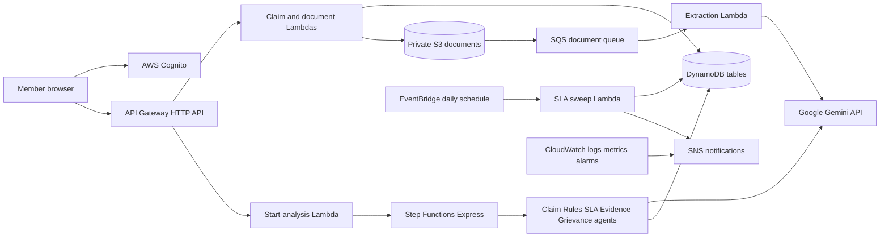

# EPF Sarthi

EPF Sarthi is an informational helper for EPFO PF Final Settlement claims.
It stores a member-entered claim, checks official rule chunks, calculates the
published timeline, evaluates uploaded evidence, and produces a reviewable
grievance draft. It does not submit anything to EPFO and does not provide legal
advice.

## Architecture



## Ship It service list

- Amazon Cognito user pool and JWT authorizer
- Amazon API Gateway HTTP API
- AWS Lambda for claim CRUD, document intake/extraction, five analysis stages,
  persistence, failure handling, and the daily SLA sweep
- AWS Step Functions Express for the analysis pipeline
- Amazon DynamoDB for claims, rule chunks, analysis runs, documents, status
  transitions, and per-user daily quotas
- Amazon S3 for encrypted private document objects
- Amazon SQS plus DLQ for document extraction
- Amazon EventBridge schedule for the daily watchdog
- Amazon SNS for status and operational alerts
- Amazon CloudWatch logs, custom metrics, dashboard, and alarms
- AWS Secrets Manager for the Gemini API key
- Google Gemini API for generation, embedding, and multimodal transcription

## What is real

- Cognito authentication and JWT-derived tenant identity
- Separate stage-named AWS resources
- Presigned direct-to-S3 uploads and asynchronous extraction
- Official-source rule retrieval with code-enforced citation and number guards
- Deterministic calendar/working-day SLA calculation
- Separate completed, abstained, validation-failure, and infrastructure-failure
  statuses
- Evidence checks preserving `NOT_FOUND` versus `CONTRADICTED`
- Reviewable grievance drafting with grounding checks
- API throttling, per-user daily caps, bounded retries, metrics, alarms, and DLQ
- Stored analysis results that reopen without automatically rerunning

## Deferred and intentionally out of scope

- Automatic EPFO or EPFiGMS submission
- Legal advice, entitlement decisions, or prediction of EPFO outcomes
- Coverage beyond the curated PF Final Settlement corpus
- Human caseworker workflow, appeals workflow, or document correction UI
- Guaranteed OCR quality for poor scans and handwriting
- High-availability failover to a second model provider
- Production load certification; simultaneous-analysis behavior requires a
  dedicated load run before describing this as production-ready

## Data flow, privacy, and retention

### Data sent to Google Gemini

The application uses the external Google Gemini API; these calls do not remain
inside AWS:

- **Generation:** Claim Agent normalisation, Rules Agent selection, Evidence
  Agent checks, and Grievance Agent drafting.
- **Embedding:** the Rules Agent’s structured rule-retrieval query.
- **Multimodal transcription:** uploaded images and scanned PDFs without a
  usable text layer.

### Redaction performed before outbound calls

The Grievance Agent recursively redacts these values in code before building
its Gemini request:

- standalone 12-digit values → `[REDACTED_UAN]`
- standalone 9–18 digit values → `[REDACTED_BANK_ACCOUNT]`
- values whose keys are `uan`, `bankaccount`, `accountnumber`, `password`,
  `secret`, `bank_account`, or `bank_account_number` → `[REDACTED]`
- inline `password`, `pass`, `pwd`, or `secret` assignments →
  `[REDACTED]`

The Rules Agent sends only claim ID, claim type, status, claim date, amount,
deficiency date, and retrieved public rule chunks. Its embedding query contains
only claim type and status.

### Important privacy limitation

Claim Agent input and Evidence Agent document text do not currently pass through
the Grievance Agent’s redactor. Multimodal transcription necessarily sends the
uploaded image/PDF bytes to Google before text is available for redaction.
Therefore users must assume uploaded documents may be processed by Google and
must not treat this prototype as an AWS-only data boundary. The demo fixture is
synthetic and deliberately contains no UAN, bank account, credentials, or real
member information.

No Gemini key is sent to the frontend or stored in plaintext environment
variables. Lambda receives only the Secrets Manager secret name and reads the
key at runtime. Application logs record model metadata and errors, not the key.

### Retention

- Uploaded S3 objects expire after **30 days**; noncurrent versions expire
  after **1 day**.
- Document rows use a **30-day DynamoDB TTL**.
- Analysis runs use a **90-day DynamoDB TTL**.
- Status-transition and quota rows use TTLs defined by their write paths.
- CloudWatch application and Step Functions logs retain **14 days**.
- Claims and rule chunks do not currently have automatic record expiry.
- Retained CloudFormation resources use `DeletionPolicy: Retain`; deleting a
  stack is not a data-erasure workflow.

## Environments and deployment

Prerequisites: SAM CLI, authenticated AWS credentials, Python 3.12-compatible
dependencies, Node.js, and a Gemini key already stored in Secrets Manager.

```bash
# Dev secret name: epf-sentinel/gemini-api-key
make deploy STAGE=dev

# Prod secret name: epf-sentinel/gemini-api-key-prod
make deploy STAGE=prod AMPLIFY_ORIGIN=https://<prod-app>.amplifyapp.com
```

The key value is never passed on the command line. Dev resources end in `-dev`;
prod resources end in `-prod`, and their S3 bucket names contain the stage.

## Demo preparation

```bash
DEMO_USER_PASSWORD='<strong password>' python scripts/seed_demo.py --stage prod
```

The script idempotently creates or reuses:

- `demo@epf-sentinel.example`
- one marked Final Settlement claim filed `2026-08-01` for ₹4,80,000,
  status `PENDING`
- one synthetic `CLAIM_AMOUNT` screenshot with no real PII

See [DEMO.md](DEMO.md) for the timed click sequence.

## Verification commands

```bash
python -m pytest tests/unit -v

API_ENDPOINT='<prod output>' \
COGNITO_USER_POOL_ID='<prod output>' \
COGNITO_CLIENT_ID='<prod output>' \
AWS_DEFAULT_REGION=ap-south-1 \
python -m pytest tests/integration -v

cd frontend && npm run lint && npm run build

python eval/verify_quote_override.py
python eval/run_rules_eval.py --verbose --delay 2
```

## Final production rules evaluation

Status on 20 Sep 2026: **blocked, not passing**.

- Cases loaded: **38**
- Cases completed: **0**
- Pass/fail counts and category metrics: **not produced**
- First blocked case: `NORM-01`
- Failure: Google Gemini `401 UNAUTHENTICATED`,
  `ACCESS_TOKEN_TYPE_UNSUPPORTED`, during `gemini-embedding-001`
  `BatchEmbedContents`

No earlier score is copied here and no rounded result is reported. Replace this
block with the exact, unrounded prod output only after a valid, non-exposed
Gemini API key is installed and all 38 cases complete.

## Production-readiness rubric

- **Isolation/security — done for prototype:** JWT tenant tests and malformed
  API inputs pass. Deferred: independent penetration review and broader
  adversarial document testing.
- **Abuse/cost controls — done:** stage throttles, daily per-user cap, Gemini
  usage alarms, and bounded retry loops.
- **Concurrency/load — deferred:** no production load certification has been
  run. Required before a general-availability claim.
- **Failure/failover — partially done:** Gemini, DynamoDB, and S3 failures were
  observed live; SQS corrupt-message/DLQ behavior is integration-tested.
  Deferred: second-provider model failover.
- **Deployment — partially done:** dev and the isolated prod AWS stack are
  deployed. The prod secret container is separate, but live model activation
  remains blocked until it has a non-exposed `AWSCURRENT` value.
- **Monitoring/alerting — done:** dashboard, SNS-backed dependency alarms, API
  and Step Functions alarms, DLQ alarm, and 26-hour silent-sweep alarm.
- **Benchmark breadth — limited:** the live suite has 38 curated cases; it is
  not a statistically representative sample of real EPFO claims.
- **Recent bug density — caution:** Module 5.2 rehearsal found stale fixtures
  and a statutory-precedence regression. Continue treating unreviewed paths as
  prototype risk.

## Limitations

- Results are informational and depend on the completeness of the curated
  official-source corpus.
- A grounded citation proves that displayed text exists in the retrieved
  source; it does not prove that no other EPFO rule applies.
- Gemini availability and quota directly affect analysis completion.
- OCR, extraction, and generation can fail; infrastructure failure is shown as
  failure and never converted into an abstention.
- Calendar outputs depend on the evaluation date and configured holiday set.
- The system does not verify identity against EPFO, banks, Aadhaar, or employers.
- The system never submits, edits, escalates, or settles a claim automatically.
